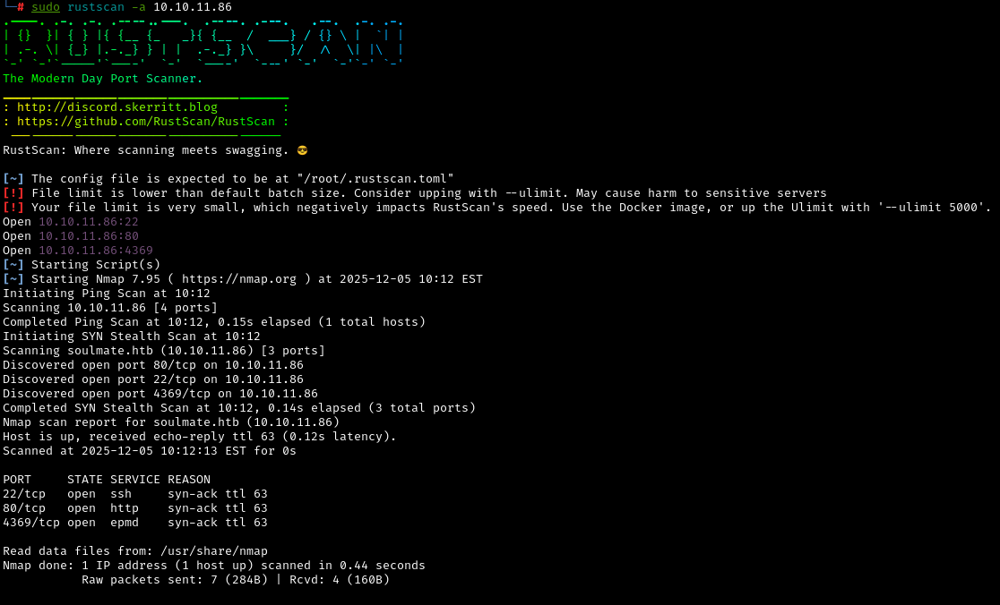
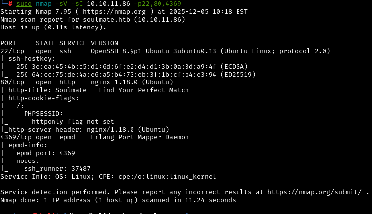
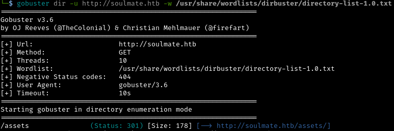
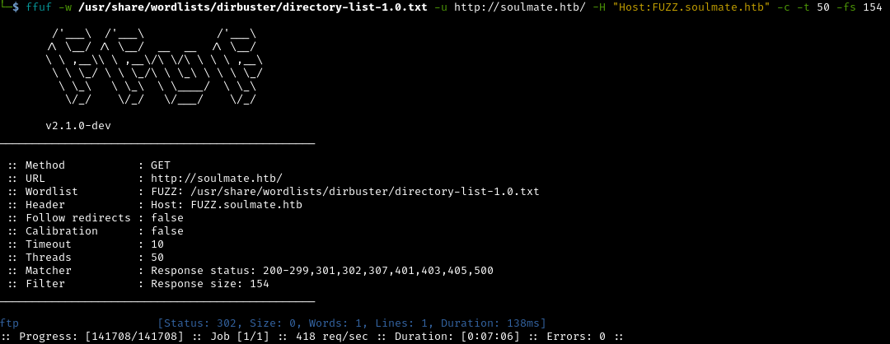
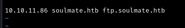
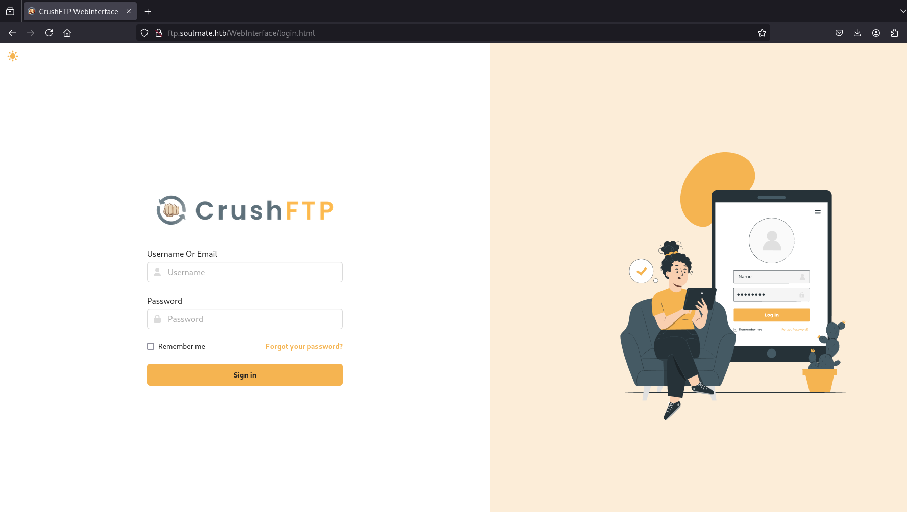
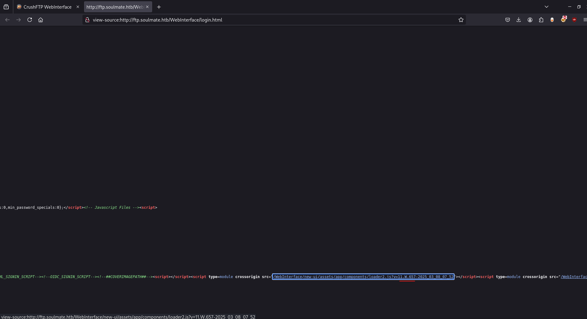
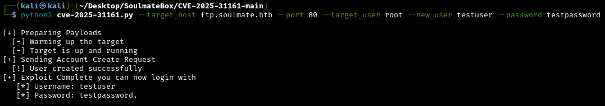

This is a write up for the Soulmate Box on HackTheBox (link [here](https://www.hackthebox.com/machines/soulmate)).

## Initial Configuration

Add this line to the bottom of your `/etc/hosts` file:

```
10.10.11.86 soulmate.htb
```

## Reconnaissance

To start, `rustscan` was used to enumerate the ports open on the target machine:

```
sudo rustscan 10.10.11.86
```



We see ports: 

 - `22`: SSH
 - `80`: HTTP Web Server
 - `4369`: EPMD (Erlang Port Mapper Daemon)

`Nmap` scan with the flags `-sV -sC` on the open ports: 

```
sudo nmap -sV -sC 10.10.11.86 -p22,80,4369
```



`Gobuster` scan to enumerate sub directories:

```
gobuster dir -u http://soulmate.htb -w /usr/share/wordlists/dirbuster/directory-list-1.0.txt
```



Gobuster didn't really return anything valuable.

Checking out the website on port `80`, we can see that it's a dating site:


To enumerate the subdomains of the website `ffuf` can be used:

```
ffuf -w /usr/share/wordlists/dirbuster/directory-list-1.0.txt -u http://soulmate.htb/ -H "Host:FUZZ.soulmate.htb" -c -t 50 -fs 154  
```



The subdomain `ftp` was found. This needs to be added to our `/etc/hosts` file, as such:



Now we can navigate over to `http://ftp.soulmate.htb`:



In the source code of the website page, we can see the version of CrushFTP:



A google search reveals CVE-2025-31161. Thanks to Immersive Labs Security, a POC can be found on [github](https://github.com/Immersive-Labs-Sec/CVE-2025-31161).

Armed with this exploit, we can create a user on the site:



Now we can log in with the credentials we just created:

